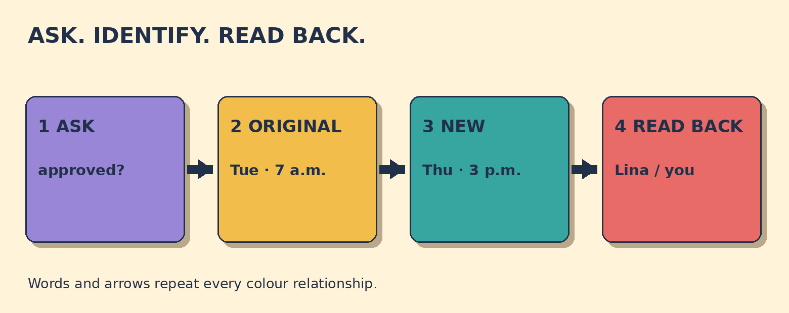

# Has My Shift Swap Been Approved?

**Goal:** Ask whether a shift swap has been approved, identify the original and new shifts, and confirm which shift to work.

You asked to swap with Lina. Your original shift is Tuesday 6 October, 7 a.m.-3 p.m. Lina's shift is Thursday 8 October, 3 p.m.-11 p.m. The manager writes: Approved. Lina covers Tuesday morning. You work Thursday evening.

## Papercut diagram

First ask whether the swap is approved. Then identify the original shift and the new shift. Read back who works each date and start time. Approval status plus two clear assignments prevents the roster details from being confused.

## Model

> Has my shift swap with Lina been approved?  
> Yes. Lina covers your Tuesday morning shift. You work her Thursday evening shift.  
> So Lina works Tuesday 6 October from 7 a.m., and I work Thursday 8 October from 3 p.m., right?

## Meaning, grammar, use

**Grammar:** Has my shift swap been approved? is a present-perfect passive question: has + subject + been + past participle. Is my shift swap approved? asks about its current status. Did you approve my shift swap? is active and names the decision-maker.

**Meaning:** The present-perfect question asks whether the approval happened before now and matters now. The readback names both dates and start times so each person knows which shift to work.

**Appropriateness:** Ask for status without assuming approval. After receiving an answer, confirm both people, both dates, and both start times. Use right? only as a check, not as pressure for agreement.

**Pronunciation:** In natural speech, has and been are often unstressed. Put stronger stress on swap, approved, Tuesday, Thursday, 7, and 3 when those details carry the contrast.

### Which line proves the swap is confirmed?

- **Approved. Lina covers Tuesday morning.** - Correct. Approved gives the status, and the next words show who covers the original shift.
- **You asked to swap with Lina.** - This proves a request exists. It does not prove the manager accepted it.
- **Your original shift is Tuesday.** - This identifies the old shift. It gives no approval status.

### Which question checks approval without assuming it?

- **Has my shift swap with Lina been approved?** - Correct. This asks whether the decision happened and matters now.
- **My shift swap is approved, isn't it?** - This expects agreement. Use an open yes-no question when the status is unknown.
- **Why haven't you approved my shift swap?** - This assumes refusal or delay. First ask whether the swap has been approved.

### Match the roster details

- **Tuesday 6 October, 7 a.m.** -> original shift
- **Thursday 8 October, 3 p.m.** -> new shift
- **Lina** -> colleague
- **approved** -> status

## Your turn

You asked to swap with Omar. Your original shift is Saturday 10 October, 10 a.m.-6 p.m. Omar's shift is Monday 12 October, 2 p.m.-10 p.m. The manager has not answered yet.

Write one neutral status question. Then imagine the manager says yes. Write a readback naming who works each date and start time.

Self-check:
- I asked about approval.
- I did not assume approval.
- I named both people.
- I named both dates.
- I named both start times.

Valid alternatives: Has ... been approved?, Is ... approved?, and Did you approve ...? can all work. They differ in grammar and focus. A readback can use covers, works, or takes if the meaning stays clear.

## Later retrieval

Tomorrow, recall this sequence: ask status, identify the original shift, identify the new shift, and read both details back.

## Sources

- Cambridge Dictionary - English Grammar Today. [Passive: forms](https://dictionary.cambridge.org/grammar/british-grammar/passive-forms). Accessed 2026-09-28. The official grammar entry was retrieved through its current search result. It supports forming passive structures with be plus a past participle. Limitation: It supports the grammar pattern, not this original roster scenario.
- Cambridge Dictionary - English Grammar Today. [Present perfect simple (I have worked)](https://dictionary.cambridge.org/grammar/british-grammar/present-perfect-simple-i-have-worked). Accessed 2026-09-28. The official result was inspected for finished events with present relevance and present-perfect question form. Limitation: It supports the time meaning, not workplace approval rules.
- Cambridge Dictionary - English Grammar Today. [Questions: echo and checking questions](https://dictionary.cambridge.org/grammar/british-grammar/questions-echo-and-checking-questions). Accessed 2026-09-28. The official entry was inspected for using checking questions to confirm what was heard. Limitation: It supports the readback function, not any specific tag or intonation in every context.
- CELTA Train. [Language Life Support](https://www.celtatrain.com/). Accessed 2026-09-28. A private course PDF copy was inspected at its introduction, MFP guidance, and present-perfect section. It separates meaning, form, pronunciation, and present relevance. Limitation: The private PDF is not redistributed. The public URL is only the publisher site.

Owner review required. No publication occurred.
