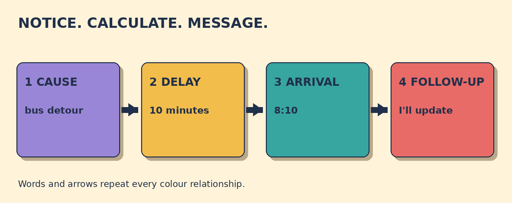

# I'm Running Ten Minutes Late

**Goal:** Report a delay, give an expected arrival time, and promise an update if the time changes.

Your shift starts at 8:00 a.m. It is 7:48. Your bus is diverted. The journey screen now shows 22 minutes. You expect to arrive at 8:10.

## Papercut diagram

First notice the changed journey time. Calculate the expected arrival. Then write four message parts: cause, delay, arrival, and follow-up. The arrival time helps the other person plan.

## Model

> Hi Sam, I'm sorry, but my bus has been diverted.  
> I'm running about ten minutes late. I expect to arrive at 8:10.  
> I'll message you if that changes.

## Meaning, grammar, use

**Grammar:** I'm running late uses am plus the -ing form. Here it describes a situation developing now. I expect to arrive uses the present simple to state your current estimate. I'll message uses will for a decision or promise made now.

**Meaning:** About ten minutes late describes the delay. At 8:10 gives the expected arrival time. These are related, but they are not the same detail.

**Appropriateness:** Contact the relevant person early. State the delay and expected arrival plainly. A brief apology can acknowledge the impact. Avoid excuses you cannot verify. Follow the real workplace process.

**Pronunciation:** In speech, stress ten minutes and 8:10. I'm contracts I am. I'll contracts I will. The details carry the message, so say them clearly.

### Which message helps the manager plan?

- **I'm sorry. My bus has been diverted. I expect to arrive at 8:10.** - Correct. It states the cause and gives a usable arrival time.
- **Something happened. I'll be there later.** - This gives no expected arrival time. The manager still cannot plan.
- **The bus system is terrible today.** - This expresses frustration. It does not state your delay or arrival time.

### It is 7:48. The journey takes 22 minutes. Which arrival estimate matches the evidence?

- **About 8:10.** - Correct. Twenty-two minutes after 7:48 is 8:10.
- **Exactly 8:00.** - The new journey time passes the 8:00 start. Do not promise the original time.
- **Sometime this morning.** - This is too broad. The journey screen supports a closer estimate.

### Match the message parts

- **My bus has been diverted.** -> cause
- **I'm about ten minutes late.** -> delay
- **I expect to arrive at 8:10.** -> arrival
- **I'll message if that changes.** -> follow-up

## Your turn

A training session starts at 2:00 p.m. It is 1:50. Your delayed bus now shows 22 minutes. You expect to arrive at 2:12.

Write one short message. Apologize briefly, state the delay, give the expected arrival time, and promise an update if needed.

Self-check:
- I contacted the person.
- I apologized briefly.
- I stated the delay.
- I gave 2:12.
- I promised an update.

Valid alternatives: Expect to arrive, should arrive, and think I'll arrive can all give an estimate. About and around show that the time is not guaranteed. A short message may omit the cause when privacy or uncertainty matters, but it should still give the delay and expected arrival.

## Later retrieval

Tomorrow, recall the four message parts: cause, delay, arrival, and follow-up.

## Sources

- Cambridge Dictionary - English Grammar Today. [Present continuous (I am working)](https://dictionary.cambridge.org/grammar/british-grammar/present-continuous-i-am-working). Accessed 2026-09-28. The official grammar entry was inspected for present-continuous form and situations in progress or developing around now. Limitation: It supports the grammar pattern, not this original commute scenario.
- Cambridge Dictionary - English Grammar Today. [Part of speech: apologize or apology?](https://dictionary.cambridge.org/grammar/british-grammar/part-of-speech-apologize-or-apology). Accessed 2026-09-28. The official entry was inspected for apologize as telling someone you are sorry. Limitation: It supports the language function, not workplace notification rules.
- CELTA Train. [Language Life Support](https://www.celtatrain.com/). Accessed 2026-09-28. A private course PDF copy was inspected at its introduction, MFP guidance, and present-continuous section. It separates meaning, form, and pronunciation and covers situations in progress, temporary situations, and future arrangements. Limitation: The private PDF is not redistributed. The public URL is only the publisher site.

Owner review required. No publication occurred.
