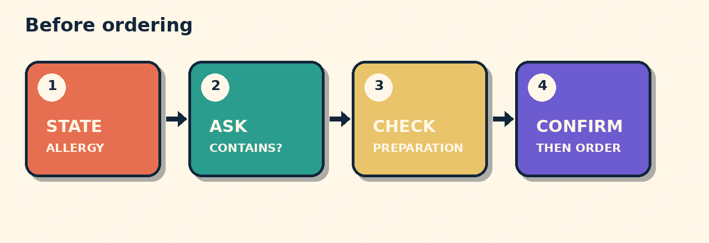

# Does This Contain Peanuts?

You are at a restaurant. You have a peanut allergy. The vegetable curry looks suitable, but the menu gives no allergen details.

## What should you say?

A. No peanuts.  
B. I have a peanut allergy. Does this curry contain peanuts?  
C. I do not like peanuts.

**B communicates the risk.** “Allergy” is not the same as “dislike.” The direct question asks about ingredients.

Staff answers: “The curry contains peanuts. The tomato soup has no peanut ingredients, but it is prepared in the same kitchen. I need to check cross-contact.”

A useful reply is: **“Please check cross-contact before I order.”**

## The pattern

**State allergy -> Ask ingredients -> Check preparation -> Wait for confirmation**

## Try it

You have an egg allergy. You want the house salad. The menu does not list dressing ingredients.

Write your question before opening this answer:

> I have an egg allergy. Does the dressing contain egg? Please check how it is prepared before I order.

This lesson teaches communication. It does not certify food safety.

## Sources

- [Food Standards Agency: Eating out or ordering food when you have an allergy](https://www.food.gov.uk/safety-hygiene/ordering-allergy-safe-food) (accessed 2026-09-28).
- [Food Standards Agency: Allergen guidance for food businesses](https://www.food.gov.uk/business-guidance/allergen-guidance-for-food-businesses) (accessed 2026-09-28).
- [Council of Europe: CEFR Companion Volume (2020)](https://rm.coe.int/common-european-framework-of-reference-for-languages-learning-teaching/16809ea0d4) (accessed 2026-09-28).

*Interactive player link: not deployed. Download the repository pack for offline use.*
