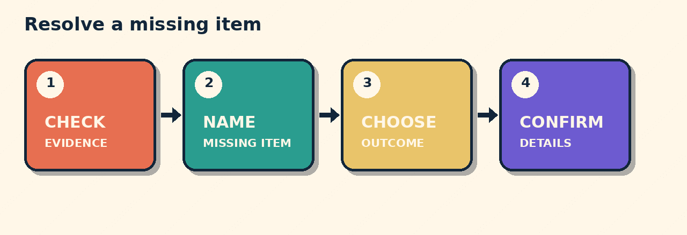

# The Garlic Bread Is Missing

Your receipt lists soup, garlic bread, and apple juice. The bag contains soup and juice.

## Which report matches?

A. My order is late.  
B. My order is missing the garlic bread.  
C. The soup is wrong.

**B matches the evidence.** The exact item matters.

Support offers replacement or refund. Choose one:

> Could you send a replacement, please?

Then confirm one detail:

> Could you confirm when it will arrive?

## The pattern

**Check evidence -> Name item -> Choose outcome -> Confirm details**

## Try it

Your takeaway receipt lists curry and rice. Only the curry arrived. You finished eating, so you want the rice refunded.

> My order is missing the rice. Could I have a refund for that item, please? Could you confirm the refund amount?

## Sources

- [Council of Europe: CEFR Companion Volume](https://rm.coe.int/common-european-framework-of-reference-for-languages-learning-teaching/16809ea0d4)
- [Merriam-Webster: refund](https://www.merriam-webster.com/dictionary/refund)
- Chris Sion, *Creating Conversation in Class*. Private reference. No text reproduced.

*Interactive player link: not deployed. Download the repository pack for offline use.*
