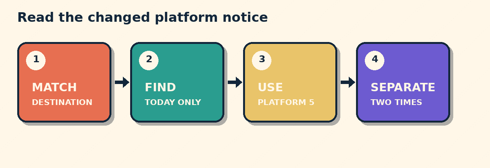

# Which Platform Changed?

The 14:20 train to Saint-Pierre usually leaves from platform 2. Today only, it leaves from platform 5. Boarding closes at 14:15.

## Which platform today?

A. Platform 2.  
B. Platform 5.  
C. Platform 14.

**B matches the exception.** The words “today only” override the usual platform.

Now state both details:

> The train leaves from platform 5 today. Boarding closes at 14:15.

## The pattern

**Match destination -> Find exception -> Use platform -> Separate times**

## Try it

An airport shuttle usually uses bay 3. A notice says: ‘Monday only: Bay 7. Boarding closes 08:40. Departure 08:45.’

> The shuttle leaves from bay 7 today. Boarding closes at 08:40.

## Sources

- [Council of Europe: CEFR Companion Volume](https://rm.coe.int/common-european-framework-of-reference-for-languages-learning-teaching/16809ea0d4)
- [Council of Europe: CEFR Global Scale](https://www.coe.int/en/web/common-european-framework-reference-languages/table-1-cefr-3.3-common-reference-levels-global-scale)
- [Merriam-Webster: platform](https://www.merriam-webster.com/dictionary/platform)

*Interactive player link: not deployed. Download the repository pack for offline use.*
