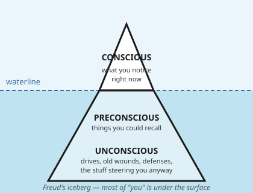
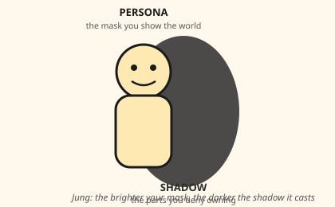
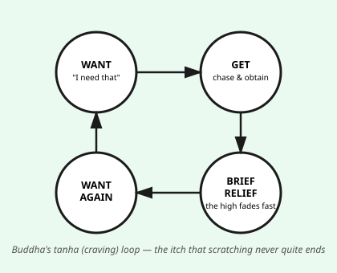
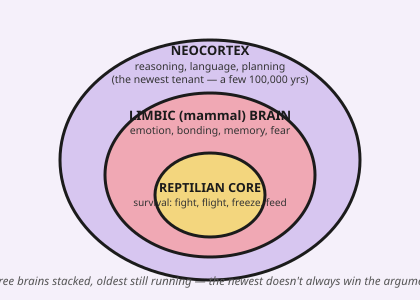
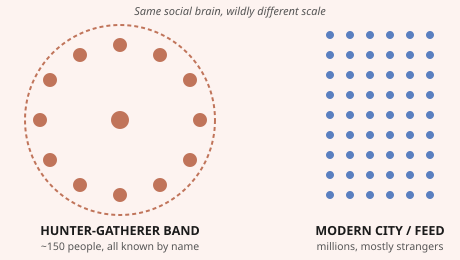

# The Ancient Machine: A Field Guide to Human Nature

*A 10-minute read on why people do what they do — with doodles.*

> **Disclaimer:** This is educational writing, not therapy, medicine, or a substitute for professional advice. It simplifies deep, contested ideas (some over a century old, some over two thousand years old) so a reader with no background can get a useful mental model in ten minutes, not a PhD. Where the science is shaky, we say so.

---

## Before you start: the uncomfortable pattern

Here's a pattern that shows up again and again in history, and it should bother you a little: **ordinary, decent people, placed in the wrong situation, do things that look monstrous in hindsight.** Ordinary neighbors turned informants. Ordinary soldiers followed orders they'd have called evil the week before. Ordinary investors piled into a bubble everyone half-knew was a bubble. Ordinary people scroll an app for three more hours knowing it's making them miserable.

We like to sort behavior into **good** and **bad**, like sorting laundry. But the same wiring that makes a parent fight to the death for their kid also makes a mob turn on an outsider. The same craving that gets an athlete out of bed at 5 a.m. also builds an addiction. The machine isn't good or bad. It's just old, powerful, and running code that was optimized for a world that no longer exists.

Four very different thinkers — a Viennese doctor, a Swiss psychiatrist, a Russian novelist, and an Indian prince-turned-monk — each found a piece of this machine, roughly 2,500 years apart. Let's meet them, then use their tools on modern life.

---

## Part 1 — Four maps of the same territory

### Freud: most of you is underwater

Sigmund Freud's big, still-useful claim: **your conscious mind is not in charge as much as it thinks it is.** He pictured the mind as an iceberg — a small visible tip (what you're aware of right now) sitting on a massive hidden mass (memories, drives, urges you've pushed out of sight because they're inconvenient or shameful).

He split the underwater machinery into three rough voices: the **id** (a toddler that wants what it wants, now, no excuses), the **superego** (the internalized rulebook — parents, culture, guilt), and the **ego** (the exhausted mediator trying to keep both happy without getting anyone arrested). When the mediator is overwhelmed, it deploys **defense mechanisms** — automatic tricks the mind uses so you don't have to feel the full weight of something painful:

- **Denial** — "I don't have a problem."
- **Projection** — accusing someone else of exactly your own hidden flaw.
- **Rationalization** — building a respectable reason for something you did for a much less respectable one.
- **Displacement** — yelling at your sibling because you can't yell at your boss.
- **Sublimation** — turning aggression into boxing, or heartbreak into a great song.

Modern psychology has dropped a lot of Freud's specific machinery (the evidence for a literal "id" as a discrete structure is thin), but the core insight survives every replication: **a large share of your behavior is driven by processes you don't consciously see, and your conscious mind is often a press secretary explaining a decision after the fact, not the decision-maker.**

### Jung: the mask and the thing behind it

Carl Jung, once Freud's protégé and later his rival, added two ideas worth carrying for life.

First, the **persona** — the mask you wear in public — always has a matching **shadow**: the traits you've disowned because they don't fit the mask. The nicer and more polished the mask, the larger and more dangerous the shadow tends to get, purely because it never gets examined.

Jung's uncomfortable observation: **the traits we hate most in other people are often the ones we've exiled from ourselves.** That coworker whose arrogance drives you up the wall might be showing you a piece of your own shadow you've refused to admit exists. This isn't always true — sometimes a jerk is just a jerk — but it's true often enough to be worth checking before you get too self-righteous.

Second, the **collective unconscious**: patterns (Jung called them archetypes — the Hero, the Trickster, the Wise Elder, the Mother) that show up in myths and stories across unconnected cultures. Jung's explanation — an inherited shared psychic layer — is the most scientifically contested part of his work and isn't accepted as literal fact by mainstream neuroscience. But the pattern he was pointing at (humans everywhere keep telling the same handful of stories) is real and worth noticing, whatever the underlying cause turns out to be.

### Dostoevsky: humans will wreck their own happiness just to prove they're free

Fyodor Dostoevsky wasn't a psychologist by trade, but *Notes from Underground* (1864) predicted something modern behavioral science later confirmed: **give people a perfectly rational, optimized system for their own happiness, and some of them will deliberately sabotage it — just to prove they're not a piano key that plays a predictable note.**

His narrator says people will choose "the most absurd thing" on purpose, out of "personal desire," because being predictable — even predictably happy — feels like a kind of death. Spite, self-sabotage, cutting off your nose to spite your face: Dostoevsky's insight is that these aren't bugs to be optimized away. They're your brain guarding its own sense of agency, sometimes at real cost to your own well-being. You've felt this: doing the thing you know is bad for you, specifically because someone (even yourself) said you should do the other thing.

### Buddha: wanting is the engine, and the engine never turns off on its own

About 2,500 years before "dopamine" was a word, the Buddha diagnosed the same loop with different vocabulary. The **Four Noble Truths**, compressed: life involves persistent dissatisfaction (*dukkha*); the cause is craving/thirst (*tanha*) — not wanting things as such, but the grasping, clinging relationship with wanting; there is a way out; and the way out is a specific practice (attention, ethics, mental training).

The mechanism he described: you want something, you get it, you feel good for a short while, the good feeling fades, and you want again — often wanting more than before. This isn't a moral failing; it's how the reward system is built. Modern neuroscience's account of dopamine (it fires more on the *anticipation* of reward than on getting it, which is why the chase feels better than the win) is a close cousin of what the Buddha described using only careful introspection.

---

## Part 2 — Why the machine feels haunted: you're running ancient software

Here's the connective tissue between all four thinkers and your actual Tuesday: **the brain making your decisions was mostly finished evolving somewhere between 50,000 and 300,000 years ago, for a world of small nomadic bands, scarce calories, constant physical danger, and total social transparency (everyone in your band knew everyone).** Agriculture is about 12,000 years old. Cities, writing, and money are younger still. Industrial society is about 250 years old. The internet is younger than most people's parents. In evolutionary terms, **modern life started five minutes ago**, and your brain hasn't had time to catch up. Researchers call the resulting friction **evolutionary mismatch**.

A simplified but genuinely useful way to picture this: three "layers" of brain stacked on top of each other, the older ones still running underneath the newest one, and the newest one does not always win the argument.

*(Caveat: neuroscientists consider this exact "three separate brains" model outdated as literal anatomy — the brain is far more interconnected than three clean layers. But as a metaphor for "instinct vs. emotion vs. reasoning pulling in different directions at once," it's still a useful teaching shortcut, which is why it survives.)*

And it isn't just your brain's wiring — it's the *scale* of your social world. For nearly all of human history, people lived and died among roughly 150 familiar faces (a number popularized by anthropologist Robin Dunbar as the rough limit of stable relationships a human brain can track). Now your phone puts you in the same "tribe" as millions of strangers, and your ancient status-and-belonging instincts — built for a village — are trying to process a species.

This single idea — old software, new hardware — explains a surprising amount of what follows.

---

## Part 3 — Running the ancient machine through modern life

Here's the same handful of ancient mechanisms, showing up over and over under different names.

| Modern thing | The ancient mechanism underneath | Who named it |
|---|---|---|
| **Habits & addiction** | The craving loop wasn't built to face substances/apps engineered to hijack it 24/7; a mismatch of ancient reward circuitry vs. modern supernormal stimuli | Buddha (*tanha*), modern dopamine research |
| **Fear & anxiety** | A threat-detection system built for lions and rival tribes, now firing at emails and social comparison | Triune brain / mismatch theory |
| **Anger** | A fast, protective response to perceived unfairness or threat to status — useful when status meant survival | Freud (id impulse), evolutionary psychology |
| **Greed** | A scarcity-era instinct to hoard calories and resources, now applied to money and stuff in a world of abundance | Mismatch theory |
| **Defense mechanisms** | The ego's automatic bodyguards against unbearable truths about yourself | Freud |
| **Sex & attraction** | Deep mate-selection instincts (status, symmetry, resources, fertility cues) operating underneath a "we're just chatting" surface | Freud, evolutionary psychology |
| **Competition** | Status-seeking that once meant access to food and mates; now chases likes, grades, promotions | Evolutionary psychology, Jung (persona display) |
| **Friendship & tribalism** | Deep in-group loyalty and out-group suspicion built for small-band survival, now scaled to nations, fandoms, and political teams | Dunbar's number, mismatch theory |
| **Religion & ideology** | A need for shared myth, meaning, and moral order that Jung traced to universal story patterns (archetypes) | Jung |
| **Politics** | Tribal loyalty plus status competition plus a craving for certainty in an uncertain world | Jung + Buddha + evolutionary psychology |
| **Knowingly making mistakes** | The refusal to be a fully predictable, optimized "piano key" — asserting free will even at a cost to yourself | Dostoevsky |
| **Innovation & risk-taking** | The same restless craving/incompleteness (*dukkha*) that causes suffering also drives exploration, art, and invention | Buddha (reframed), Freud (sublimation) |
| **Peace & happiness** | Not the *absence* of craving's object, but a changed *relationship* to craving itself — Buddha's actual proposed fix | Buddha |

A few of these deserve one more sentence each, because they're the ones people find hardest to accept:

**Defense mechanisms as a feature, not a flaw.** You are not "weak" for rationalizing a mistake or getting defensive when criticized — that's the ego doing its evolved job of protecting you from a psychological injury faster than you can consciously process it. The goal isn't to have zero defenses; it's to notice them operating in real time, which is the one thing Freud's whole model was built to help you do.

**Anger and greed aren't simply "bad."** Anger that stayed proportional protected people from being exploited; a hunter-gatherer who couldn't feel possessive greed over scarce winter food didn't pass on genes. The trait didn't vanish because it stopped being useful in every case — it's still useful in some modern cases (anger at real injustice; ambition that builds things). The problem isn't the emotion; it's a 300,000-year-old dial with no "modern abundance" setting, so it can overshoot.

**Tribalism explains a lot of politics that feels insane from the outside.** The venom people feel toward the "other side" politically activates some of the same brain circuitry as real inter-group conflict once did — even though almost no modern political disagreement is actually life-or-death the way it would have been for a rival band 20,000 years ago. Knowing this doesn't make the disagreement wrong, but it explains why the *feeling* is so disproportionate to the actual stakes.

**Repeated historical events are the receipts.** Financial bubbles (tulip mania to crypto), scapegoating of minorities in hard times, the "banality of evil" documented in ordinary bureaucrats who enabled atrocities, the reliably crushing effect of solitary confinement on a deeply social-brained species — these keep recurring across unrelated cultures and centuries because the underlying machine (status competition, in-group/out-group threat response, obedience to authority, craving) is the same machine every time. It's not that history repeats because people are stupid; it's that people are running very similar hardware under similar pressures.

---

## Part 4 — Why "good vs. bad" is the wrong lens

Every trait above cuts both ways, depending only on **degree and context**:

- Craving → addiction *or* the drive to master a skill.
- Anger → cruelty *or* the fuel for standing up to a bully.
- Tribal loyalty → genocide-enabling nationalism *or* the trust that lets a rescue team run into a fire for a stranger.
- Defense mechanisms → self-deception *or* the psychological shock absorber that lets you function the day after real trauma.
- Restless dissatisfaction → self-sabotage *or* every act of art, exploration, and invention humans have ever produced.

None of these traits is a design flaw. They were all *selected for* because, on average, across a hundred thousand years, they kept enough humans alive and reproducing. Calling them "bad" is like calling a kitchen knife "bad" because it can also stab someone — true in one context, useless as a full description of the object.

The genuinely useful question isn't *"is this trait good or bad?"* It's **"is this trait, right now, in this modern context, helping me or running unchecked?"** That's a question about calibration, not morality — and it's a question the ancient machine cannot ask about itself. Only the newest, most fragile layer — conscious reflection — can ask it. Which is the entire reason to learn any of this.

---

## Part 5 — What to actually do with this

1. **Name the loop before you're in it.** "This is the craving loop" or "this is my shadow talking" turns an automatic reaction into a choice, even if only barely.
2. **Assume everyone (including you) has a shadow.** The people you find most insufferable are a decent map of what you've disowned in yourself. Not always — but check before you're sure it's always the other person.
3. **Ask what problem the trait solved for 90,000 years before you try to delete it.** Working with an instinct's original purpose is usually more effective than fighting it head-on.
4. **Expect spite.** If you (or someone else) sabotage a "perfectly rational" plan, that's not random self-destruction — it might be the Dostoevsky reflex protecting a sense of freedom. Build in real choice, not just optimized paths, and the sabotage often drops.
5. **Treat "us vs. them" feelings as a signal to check the actual stakes**, not a fact about the other side's character. Ask: would this feeling make sense if the disagreement were actually life-or-death? If not, it's mismatch, not truth.

---

## Gaps in this research (for follow-up)

Being straight about the limits of this simplification matters as much as the content itself:

- **Freud and Jung's specific mechanisms** (id/ego/superego as literal structures, the collective unconscious as literally inherited) are largely unfalsifiable as originally stated and are not treated as established fact in mainstream clinical psychology today — their value is as *descriptive metaphors that predicted real patterns*, later partly confirmed by cognitive and behavioral science, not as anatomical or genetic claims.
- **The "triune brain" (reptilian/limbic/neocortex)** is explicitly flagged above as an outdated model of brain structure, kept here only as a teaching metaphor — a rigorous follow-up should use modern network-based neuroscience models instead.
- **Evolutionary psychology explanations** (for sex, competition, tribalism) are often plausible but hard to test directly, since we can't rerun 100,000 years of human evolution in a lab — treat specific "just-so" explanations as reasonable hypotheses, not settled proof, and look for cross-cultural and archaeological evidence where possible.
- **Buddhist psychology and Dostoevsky's insights** are philosophical/contemplative and literary, not empirical science — their strength is descriptive accuracy about lived experience, validated informally by how well they match modern behavioral-science findings (e.g., dopamine/anticipation research echoing the craving loop), not by controlled experiments of their own.
- A genuinely rigorous follow-up would bring in **modern sources this piece didn't cover**: attachment theory (Bowlby), the negativity bias and loss aversion literature (Kahneman & Tversky), the Stanford/Milgram obedience studies (and their serious modern methodological critiques), and current cross-cultural anthropology on hunter-gatherer societies (which are more socially and politically varied than the single "band of 150" model suggests).

---

## Sources consulted

- [Id, Ego, and Superego — Simply Psychology](https://www.simplypsychology.org/psyche.html)
- [Id, ego and superego — Wikipedia](https://en.wikipedia.org/wiki/Id,_ego_and_superego)
- [Defense Mechanisms — StatPearls, NIH](https://www.ncbi.nlm.nih.gov/books/NBK559106/)
- [Carl Jung's Theory of Personality — Simply Psychology](https://www.simplypsychology.org/carl-jung.html)
- [Embracing the Shadow — Carl Jung, Orion Philosophy](https://orionphilosophy.com/the-shadow-carl-jung/)
- [Notes from Underground — Philosophy guide, Philosophize This!](https://philosophizethis.substack.com/p/dostoevsky-notes-from-underground)
- [An Analysis of Freedom and Rational Egoism in Notes From Underground — Denison University](https://digitalcommons.denison.edu/cgi/viewcontent.cgi?article=1111&context=episteme)
- [The Buddha's Four Noble Truths — Philosophy Break](https://philosophybreak.com/articles/the-buddha-four-noble-truths-the-cure-for-suffering/)
- [Four Noble Truths — Wikipedia](https://en.wikipedia.org/wiki/Four_Noble_Truths)
- [Evolutionary mismatch — Wikipedia](https://en.wikipedia.org/wiki/Evolutionary_mismatch)
- [Evolutionary Mismatch — Psychology Today](https://www.psychologytoday.com/us/blog/naturally-selected/201804/evolutionary-mismatch)
- [Hunter-Gatherers, Mismatch and Mental Disorder — Cambridge, *Evolutionary Psychiatry*](https://www.cambridge.org/core/books/abs/evolutionary-psychiatry/huntergatherers-mismatch-and-mental-disorder/8205CFCBE785351D4AE740F4EC95B8A7)

---

*Written for a young audience thinking about a complex future. If one idea here is worth keeping: you didn't choose this machine, but you're the only part of it that can watch itself run.*
